<p align="center"><a href="https://laravel.com" target="_blank"></a></p>


#### Nombre: Edison Nicolasc Guamialama Haro
#### NRC: 29692
#### Instructor: Ing. Vilmer David Criollo 

###  PRY\_MICROSRV\_AUTENTICACION
####  Resumen del Proyecto

Este repositorio aloja el **Microservicio de Autenticación**, el componente fundamental para la gestión de acceso en el sistema de publicaciones distribuido. Su diseño sigue los principios de **Arquitectura Orientada a Microservicios (MSA)**, garantizando el desacoplamiento total de la lógica de usuarios y posts.

La funcionalidad principal es proporcionar un **Servidor de Autorización** centralizado que utiliza tokens Sanctum y un control de acceso basado en perfiles (RBAC) a través de un *middleware* personalizado.

-----

#### Arquitectura Técnica y Componentes Clave

#### Especificaciones de Implementación

| Componente | Detalle Técnico | Propósito MSA |
|:---|:---|:---|
| **Framework** | Laravel 12 (PHP v8.2+) | Base ágil para API RESTful. |
| **Base de Datos** | MySQL | Persistencia de datos de usuario. |
| **Autenticación** | Laravel **Sanctum** | Emisión y gestión de *Bearer Tokens* (Stateless). |
| **Autorización** | `App\Http\Middleware\CheckUserRole` | Valida el `perfil` (`role`) del usuario en cada solicitud protegida. |
| **Comunicación** | Endpoint `/api/validate-token` | Permite que otros microservicios deleguen la verificación del token. |
| **Perfil/Rol** | Columna `perfil` en `users` | Soporta `administrador`, `editor` y `usuario común`. |

-----

### Guía de Instalación y Despliegue

#### Prerrequisitos del Entorno

* **PHP:** Versión 8.2 o supeior.
* **Composer:** Gestor de dependencias de PHP.
* **MySQL:** Servidor de base de datos.

#### Pasos Operacionales

Creacion del Proyecto "PRY\_MICROSRV\_AUTENTICACION"

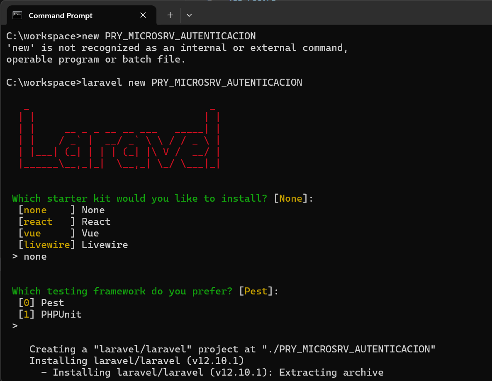

Configuracion la base de datos a utilizar 
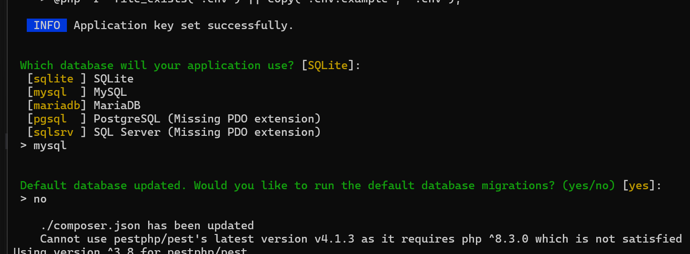
check  instalacion exitosa 
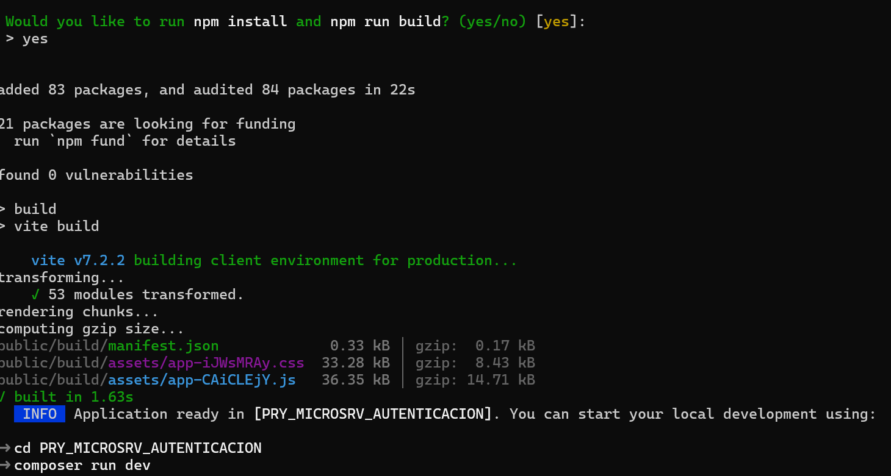

configuracion de .env
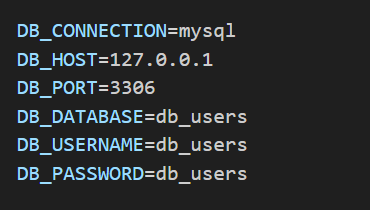


Entorno de desarrollo IP maquina

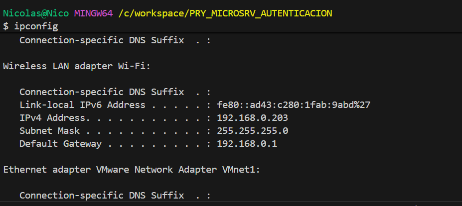

  
    
1.  **Instalar Dependencias:**
    ```bash
    composer install
    ```

2.  **Configurar Variables de Entorno:**
    ```bash
    cp .env.example .env
    php artisan key:generate
    # EDITE las variables de base de datos y la clave APP_ID para la conexión con otros microservicios.
    ```
3.  **Migrar y Seeders:**
    ```bash
    php artisan migrate --seed
    ```
4.  **Iniciar Servidor:**
    ```bash
    php artisan serve 
    ```
    El servicio estará accesible en `http://127.0.0.1:8000`.

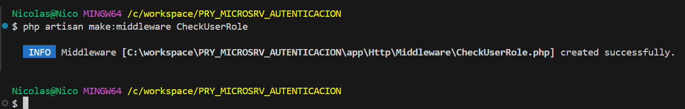
creacion de nuevo usuario en Xampp http://localhost:8012/phpmyadmin/

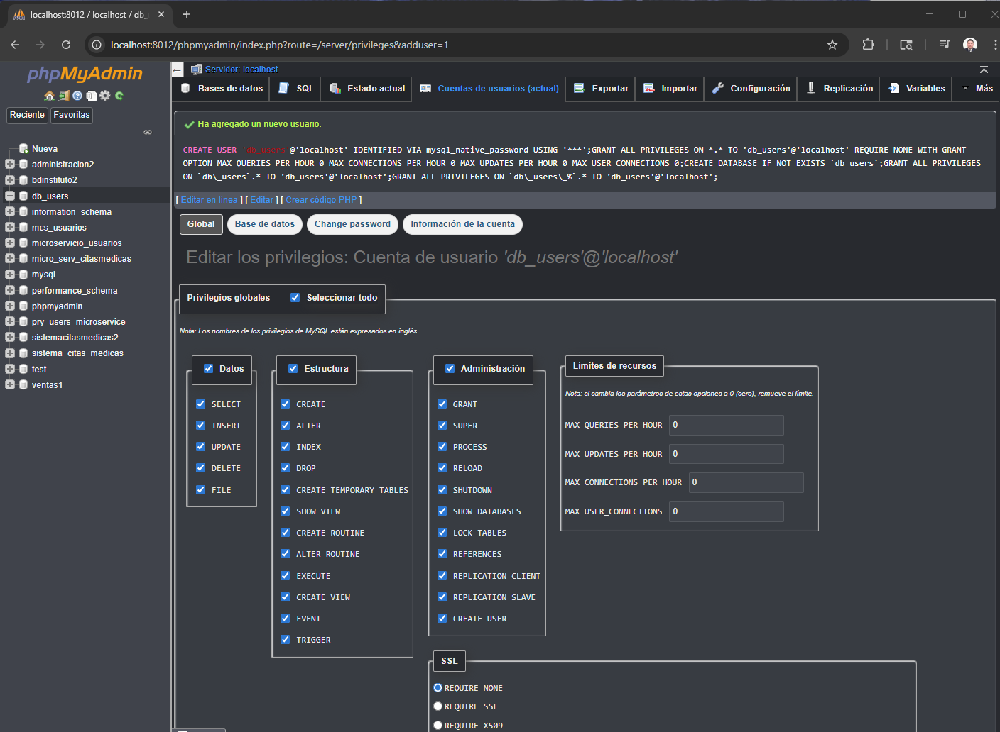

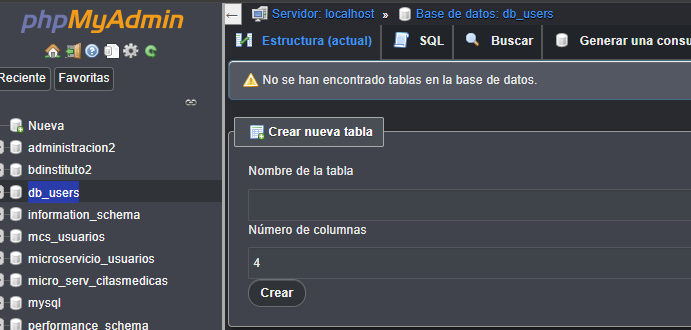

creacion de perfil y migracion 


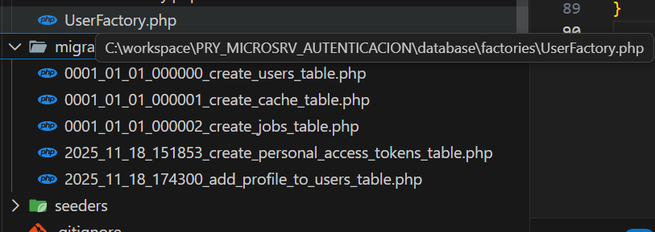

creacion de usuario

levantar el servicio en la direccion local

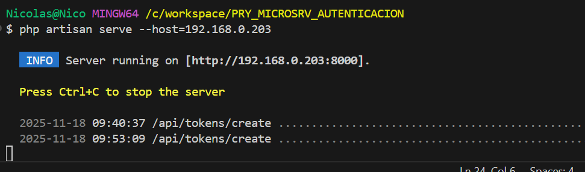
-----

## 🔑 5. Endpoints Principales

Base URL: `http://127.0.0.1:8000/api`

| Método | Endpoint | Headers | Payload (JSON) | Respuesta |
|:---|:---|:---|:---|:---|
| POST | `/register` | Content-Type: application/json | `{name, email, password, password\_confirmation, rol}` | `201 + {token}` |
| POST | `/login` | N/A | `{email, password}` | `200 + {token}` |
| POST | `/logout` | Authorization: Bearer <token> | N/A | `200 {message}` |
| GET | `/user` | Authorization: Bearer <token> | N/A | `200 {user\_data}` |
| GET | `/validate-token` | Authorization: Bearer <token> | N/A | `200 OK` o `401 Unauthorized` |
 
-----
Evidencias de las practicas


Creacion de administrador 
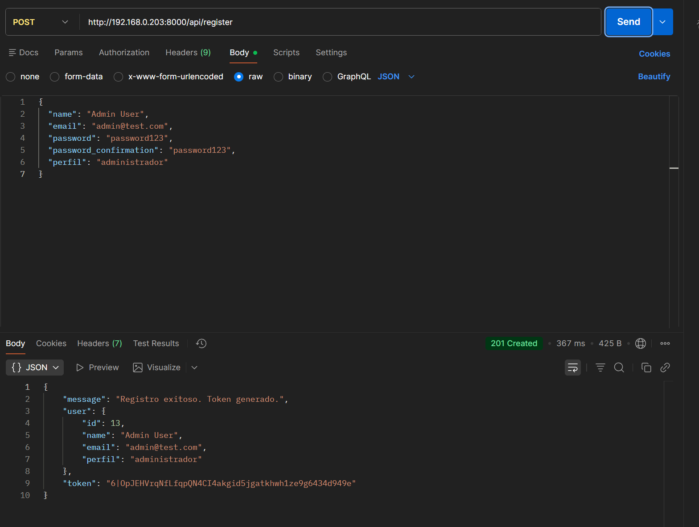

token 


verificacion 


verificacion 2
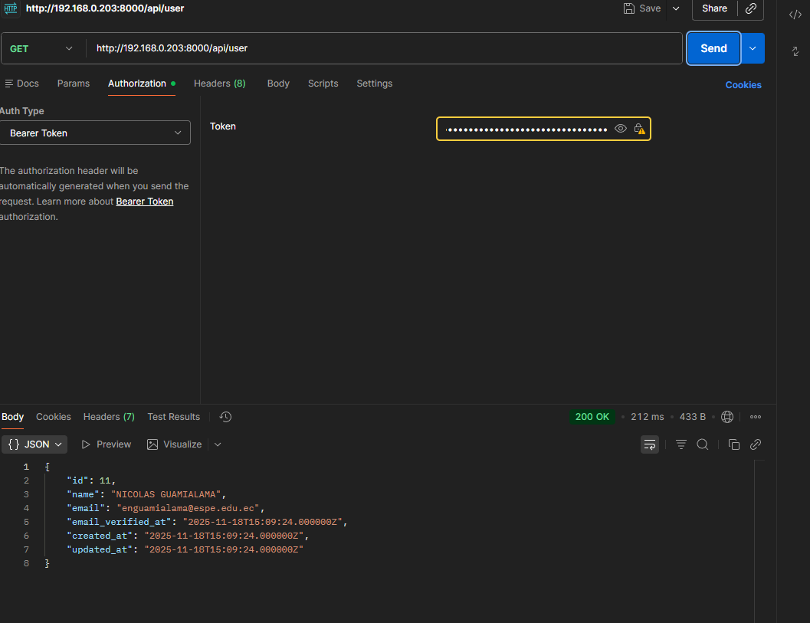

registro de segundo usuario 

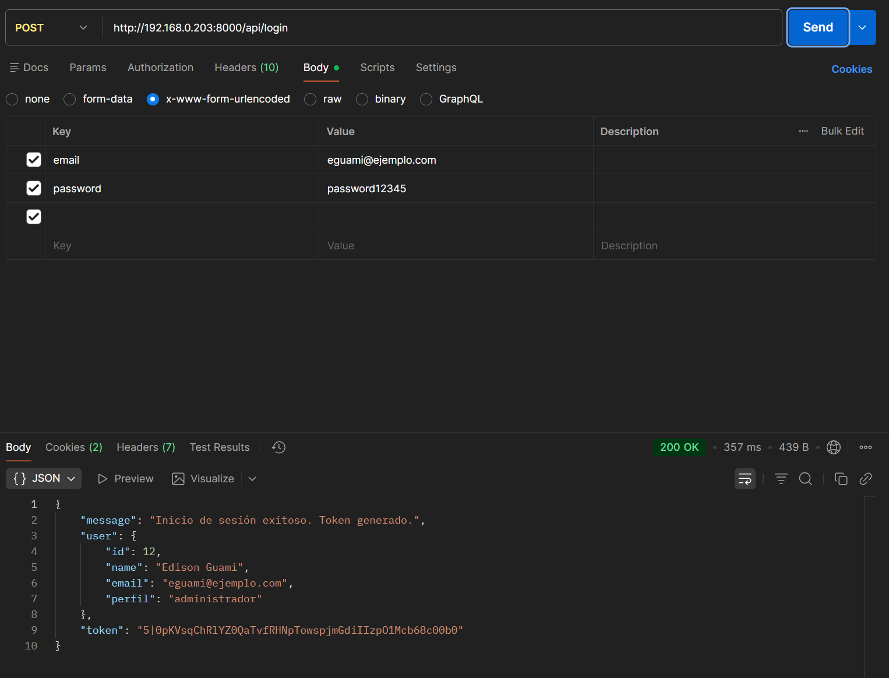


tercer usuario  comun

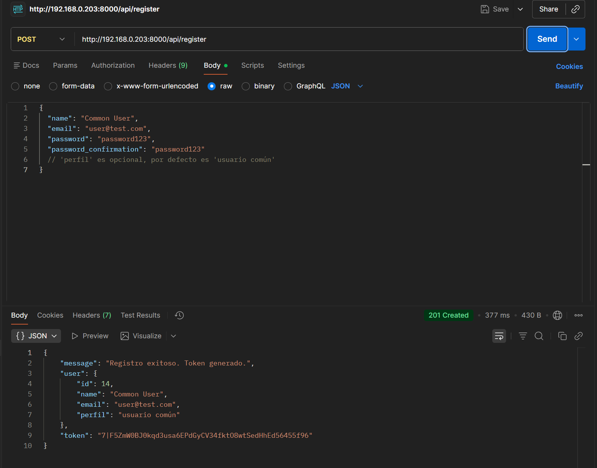

confirmacion en la base de datos (db_user)las creaciones de los usuarios 


#### 6. Seguridad y Pruebas

##### Características de Seguridad
* **Contraseñas hasheadas** con `bcrypt` (10 rounds).
* **Tokens de acceso** de 40 caracteres, almacenados hasheados (`sha256`).
* **Middleware `auth:sanctum`** protege rutas sensibles.
* **Middleware personalizado `role`** restringe acciones por perfil.
* Sin almacenamiento de sesiones en servidor (stateless).


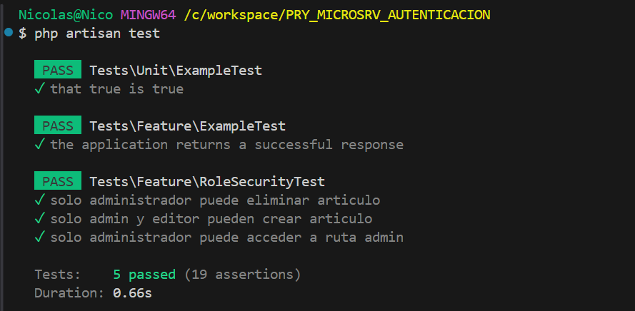

#### Ejecución de Pruebas

Para ejecutar las pruebas que validan el middleware de roles (`CheckUserRole`), use:

```bash
php artisan test
```
```
**Clonar y Acceder:**
    ```bash
    git clone [https://github.com/ENiko-Gh/PRY_MICROSRV_AUTENTICACION.git
    cd pry-microserv-autenticacion
```
```


## About Laravel

Laravel is a web application framework with expressive, elegant syntax. We believe development must be an enjoyable and creative experience to be truly fulfilling. Laravel takes the pain out of development by easing common tasks used in many web projects, such as:

- [Simple, fast routing engine](https://laravel.com/docs/routing).
- [Powerful dependency injection container](https://laravel.com/docs/container).
- Multiple back-ends for [session](https://laravel.com/docs/session) and [cache](https://laravel.com/docs/cache) storage.
- Expressive, intuitive [database ORM](https://laravel.com/docs/eloquent).
- Database agnostic [schema migrations](https://laravel.com/docs/migrations).
- [Robust background job processing](https://laravel.com/docs/queues).
- [Real-time event broadcasting](https://laravel.com/docs/broadcasting).

Laravel is accessible, powerful, and provides tools required for large, robust applications.

## Learning Laravel

Laravel has the most extensive and thorough [documentation](https://laravel.com/docs) and video tutorial library of all modern web application frameworks, making it a breeze to get started with the framework. You can also check out [Laravel Learn](https://laravel.com/learn), where you will be guided through building a modern Laravel application.

If you don't feel like reading, [Laracasts](https://laracasts.com) can help. Laracasts contains thousands of video tutorials on a range of topics including Laravel, modern PHP, unit testing, and JavaScript. Boost your skills by digging into our comprehensive video library.

## Laravel Sponsors

We would like to extend our thanks to the following sponsors for funding Laravel development. If you are interested in becoming a sponsor, please visit the [Laravel Partners program](https://partners.laravel.com).

### Premium Partners

- **[Vehikl](https://vehikl.com)**
- **[Tighten Co.](https://tighten.co)**
- **[Kirschbaum Development Group](https://kirschbaumdevelopment.com)**
- **[64 Robots](https://64robots.com)**
- **[Curotec](https://www.curotec.com/services/technologies/laravel)**
- **[DevSquad](https://devsquad.com/hire-laravel-developers)**
- **[Redberry](https://redberry.international/laravel-development)**
- **[Active Logic](https://activelogic.com)**

## Contributing

Thank you for considering contributing to the Laravel framework! The contribution guide can be found in the [Laravel documentation](https://laravel.com/docs/contributions).

## Code of Conduct

In order to ensure that the Laravel community is welcoming to all, please review and abide by the [Code of Conduct](https://laravel.com/docs/contributions#code-of-conduct).

## Security Vulnerabilities

If you discover a security vulnerability within Laravel, please send an e-mail to Taylor Otwell via [taylor@laravel.com](mailto:taylor@laravel.com). All security vulnerabilities will be promptly addressed.

## License

The Laravel framework is open-sourced software licensed under the [MIT license](https://opensource.org/licenses/MIT).

```


# PRY_MICROSRV_AUTENTICACION
